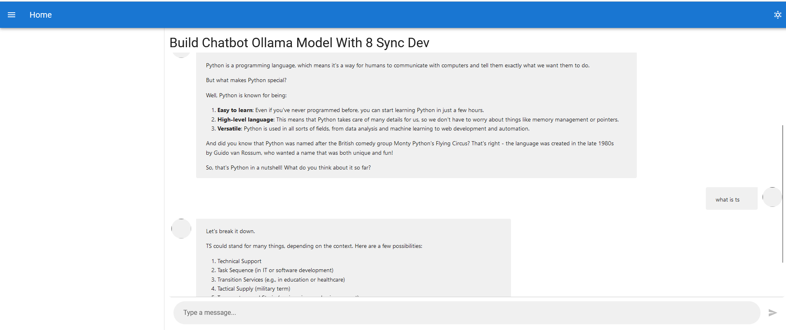

# Build Chat AI | 8 Sync Dev

    
    

## Yêu cầu
- Thông hiểu Python: [Học miễn phí tại đây](https://www.youtube.com/playlist?list=PLQN04f9L0qqE7y318UJ_jdYjz_a0HfdUL)

- Thông hiểu moudle pattern: [Học miễn phí tại đây](https://youtu.be/Zcn9NJtCNas?si=16TsCEogkxIMUAGt)

- Các khóa và lộ trình chi tiết của các lớp học: [Liện hệ tại đây](https://www.facebook.com/8sync)

## Giới Thiệu

### 1. **Ollama**
- **Ollama** là một công cụ được thiết kế để hỗ trợ xây dựng và triển khai các mô hình học sâu. 
- **Ứng dụng trong dự án**: Ollama có thể được sử dụng để phát triển các mô hình dự đoán hoặc phân loại, đặc biệt hữu ích trong việc xây dựng các mô hình AI hoặc chatbot có khả năng học và tương tác thông minh với người dùng.

### 2. **Solara**
- **Solara** là một framework xây dựng ứng dụng web tương tác mạnh mẽ, cho phép phát triển giao diện người dùng tương tác cao mà không cần nhiều mã JavaScript.
- **Ứng dụng trong dự án**: Trong dự án của bạn, Solara có thể được sử dụng để xây dựng giao diện người dùng (UI) cho các thành phần như chat, bảng điều khiển, hoặc các trang web, giúp người dùng tương tác với các mô hình AI một cách trực quan và dễ dàng.

### 3. **LangChain**
- **LangChain** là một framework nhằm tạo ra các hệ thống sử dụng ngôn ngữ tự nhiên để tương tác và thao tác với dữ liệu, đặc biệt hiệu quả trong việc xử lý ngôn ngữ tự nhiên (NLP).
- **Ứng dụng trong dự án**: LangChain có thể được tích hợp để xây dựng các chức năng xử lý ngôn ngữ tự nhiên cho chatbot hoặc các hệ thống phân tích văn bản trong dự án, giúp nâng cao khả năng tương tác và hiểu biết của hệ thống.

### **Cách tích hợp vào dự án**
- **Ollama** có thể được dùng để phát triển các mô hình AI cốt lõi.
- **Solara** sẽ đóng vai trò là giao diện người dùng, kết nối giữa người dùng và mô hình AI, cung cấp trải nghiệm tương tác.
- **LangChain** hỗ trợ việc hiểu và xử lý các câu lệnh ngôn ngữ tự nhiên, giúp cải thiện trải nghiệm người dùng khi tương tác với hệ thống AI.

Cả ba công cụ này đều có thể kết hợp chặt chẽ trong một dự án để tạo ra một hệ thống AI hoàn chỉnh với khả năng giao tiếp tự nhiên và giao diện người dùng mạnh mẽ.

---

### Cấu trúc thư mục dự án

Dự án của bạn được tổ chức thành các thư mục và tệp như sau:

1. **Thư mục `app/`**:
   - Chứa cấu trúc chính của ứng dụng.
   - Thư mục này hiện tại chỉ chứa thư mục con là `__pycache__`, nơi lưu trữ các tệp biên dịch Python (.pyc) sau khi thực thi mã.

2. **Thư mục `components/`**:
   - Chứa các thành phần (components) tái sử dụng trong ứng dụng.
   - **Thư mục `__pycache__/`**: Lưu trữ tệp biên dịch Python.
   - **Tệp `__init__.py`**: Xác định thư mục `components` là một module Python. 
   - **Tệp `show_chat.py`**: Có thể là một component xử lý chức năng liên quan đến hiển thị hoặc tương tác với chat.

3. **Thư mục `layouts/`**:
   - Chứa các bố cục (layouts) dùng cho các trang hoặc thành phần khác.
   - **Thư mục `__pycache__/`**: Lưu trữ tệp biên dịch Python.
   - **Tệp `__init__.py`**: Xác định thư mục `layouts` là một module Python.
   - **Tệp `base_layout.py`**: Có thể chứa bố cục cơ bản dùng làm nền tảng cho các bố cục khác.

4. **Thư mục `pages/`**:
   - Chứa các trang chính của ứng dụng.
   - **Thư mục `__pycache__/`**: Lưu trữ tệp biên dịch Python.
   - **Tệp `__init__.py`**: Xác định thư mục `pages` là một module Python.
   - **Tệp `home_page.py`**: Có thể là trang chính hoặc trang chủ của ứng dụng.
   - **Tệp `router.py`**: Có thể xử lý điều hướng giữa các trang.
   - **Tệp `setting.py`**: Có thể chứa các cài đặt hoặc cấu hình của trang.

5. **Thư mục `board/`**:
   - Có thể chứa các thành phần hoặc logic liên quan đến "bảng" (board), nhưng hiện tại thư mục này trống.

6. **Thư mục `doc/`**:
   - Chứa tài liệu của dự án.
   - **Tệp `doc.md`** và **`doc.pdf`**: Tệp tài liệu hướng dẫn, mô tả, hoặc báo cáo.

7. **Thư mục `venv/`**:
   - Đây là thư mục môi trường ảo của Python, nơi chứa các thư viện và gói được cài đặt mà không ảnh hưởng đến môi trường Python toàn cục.

8. **Các tệp khác**:
   - **`.gitignore`**: Danh sách các tệp và thư mục cần bỏ qua khi đẩy mã nguồn lên Git.
   - **`main.py`**: Có thể là tệp chính để khởi động ứng dụng.
   - **`README.md`**: Tệp tài liệu cung cấp thông tin tổng quan về dự án.
   - **`requirements.txt`**: Danh sách các thư viện Python cần thiết để chạy ứng dụng, đã được chỉnh sửa gần đây.

### Mục đích
- Cấu trúc này giúp phân chia rõ ràng các phần chức năng của ứng dụng, dễ bảo trì và phát triển. 
- Mỗi thư mục/module có thể đại diện cho một phần của ứng dụng, từ các component, bố cục, trang cho đến tài liệu.

---